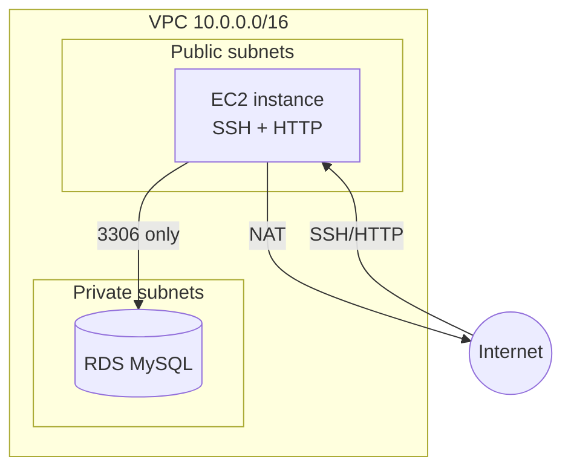

> **Note:** This standalone repo has been consolidated into [terraform-aws-reference-architecture](https://github.com/durrello/terraform-aws-reference-architecture), which collects these AWS Terraform examples into one progressive, CI-validated reference. This repo is kept for history.

# ec2-rds-vpc

Terraform configuration that provisions a complete AWS network tier — a VPC with public and private
subnets, a NAT gateway, an EC2 instance in a public subnet, and a MySQL RDS instance locked into the
private subnets. Security groups are wired so only the EC2 instance can reach the database.

## Architecture



- **VPC**: built with the community `terraform-aws-modules/vpc` module (v5.0.0), NAT gateway enabled.
- **EC2 security group**: ingress on 22 (SSH) and 80 (HTTP); egress open.
- **RDS security group**: ingress on 3306 **only** from the EC2 security group — the database is not
  publicly reachable.
- **RDS**: placed in a DB subnet group spanning the private subnets.

## What this demonstrates

- Public/private subnet segmentation with a NAT gateway
- Least-exposure database access (SG-to-SG rule rather than CIDR)
- Reuse of a well-maintained community VPC module
- Environment-driven naming via `var.environment`

## Prerequisites

- [Terraform](https://developer.hashicorp.com/terraform/downloads) >= 1.3
- AWS credentials configured
- An S3 bucket for remote state (see `backend.tf`)

## Usage

```bash
cp terraform.tfvars.example terraform.tfvars   # fill in your values
export TF_VAR_db_password='your-strong-password'  # keep secrets out of files

terraform init
terraform fmt -check
terraform validate
terraform plan
terraform apply
```

Tear down with `terraform destroy`.

## Key variables

| Variable | Default | Description |
|----------|---------|-------------|
| `environment` | `dev` | Prefix for resource names |
| `vpc_cidr` | — | VPC CIDR block |
| `availability_zones` | — | List of AZs |
| `public_subnets_cidr` | `10.0.101.0/24`, `10.0.102.0/24` | Public subnet CIDRs |
| `private_subnets_cidr` | `10.0.1.0/24`, `10.0.2.0/24` | Private subnet CIDRs |
| `db_engine` / `db_engine_version` | `mysql` / `8.0.35` | RDS engine |
| `db_password` | _(no default — required)_ | RDS master password (sensitive) |

## Security notes

- `db_password` has **no default** and is marked `sensitive` — supply it via `TF_VAR_db_password`
  or a gitignored tfvars file. Never commit it.
- For production: set `skip_final_snapshot = false`, enable storage encryption and Multi-AZ, and
  restrict the EC2 SSH ingress to known IPs rather than `0.0.0.0/0`.

## License

MIT
